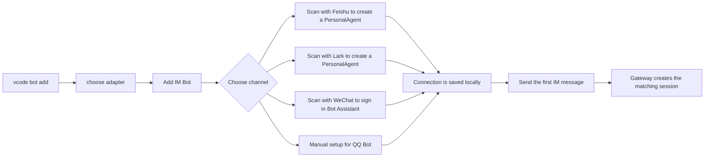
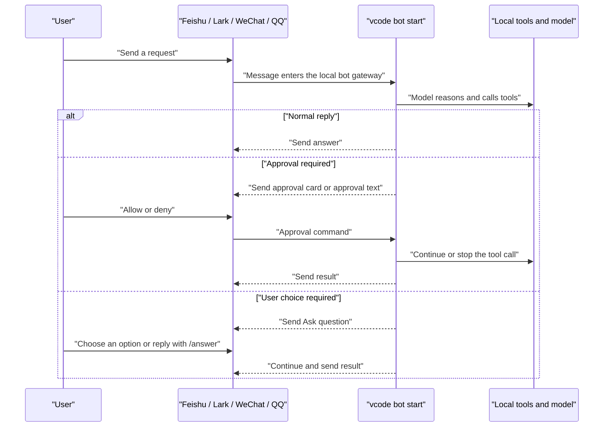
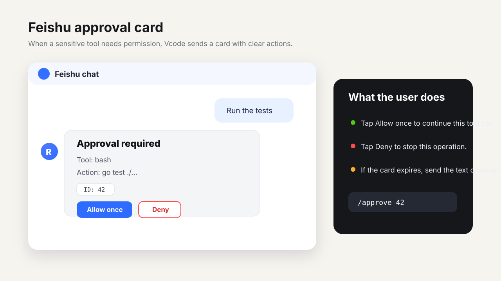
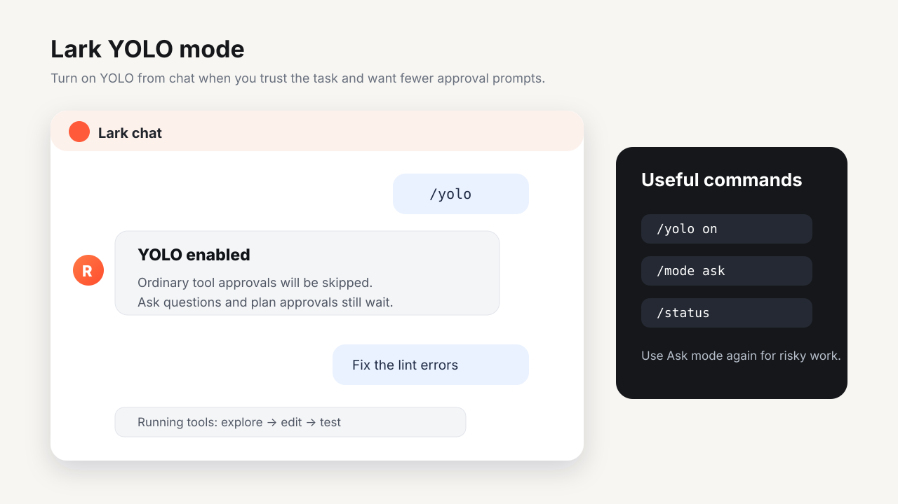
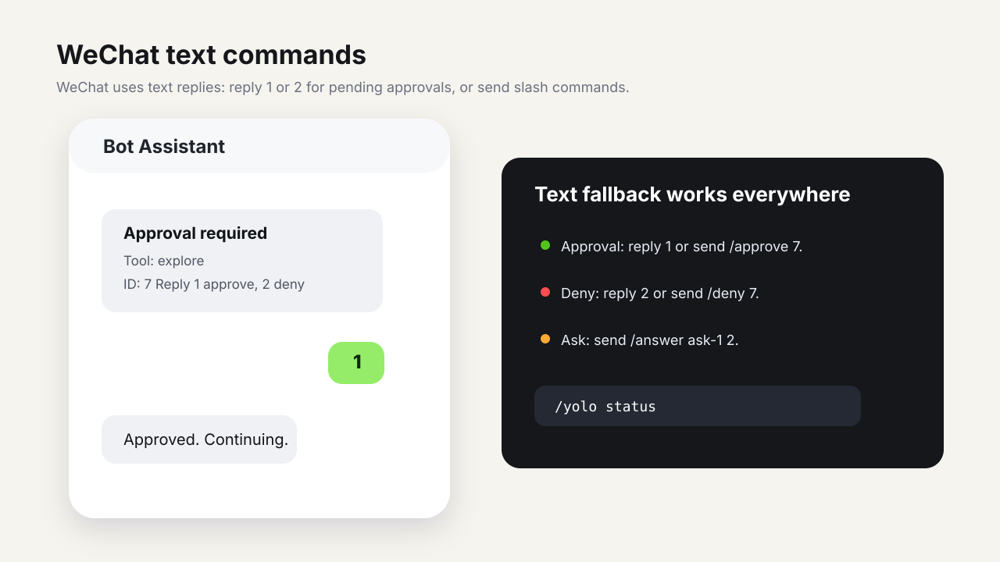
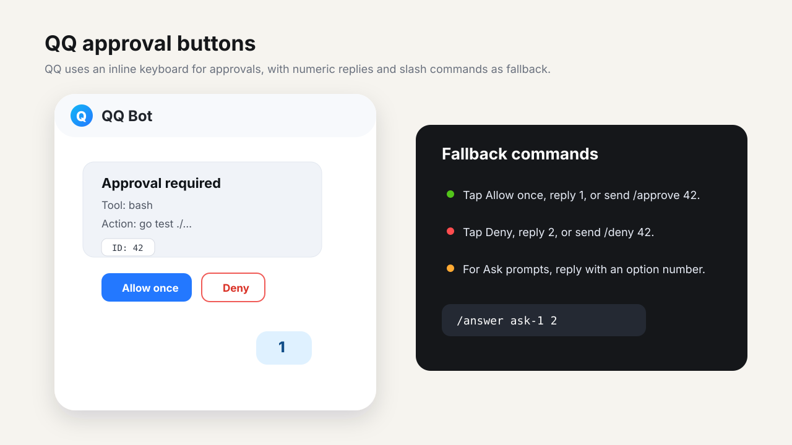
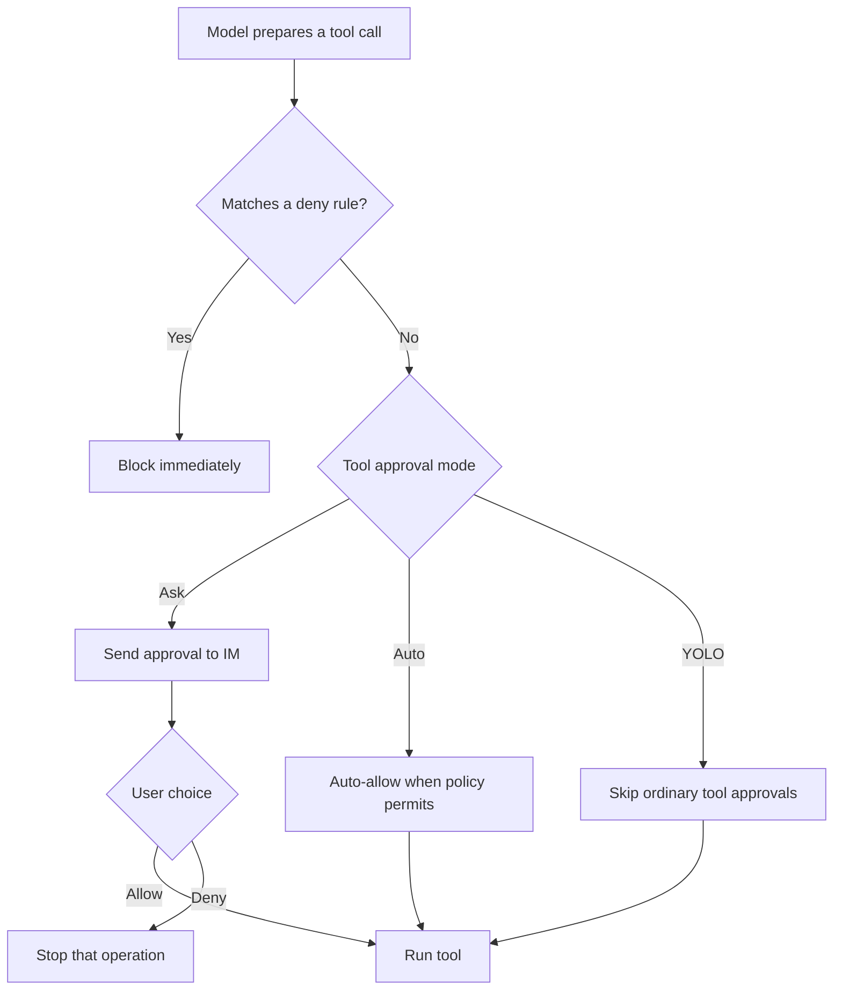

# Vcode Bot Guide

<a href="../README.md">README</a>
&nbsp;·&nbsp;
<a href="./BOT_GUIDE.zh-CN.md">简体中文</a>
&nbsp;·&nbsp;
<a href="./GUIDE.md">General guide</a>

> For CLI users. This guide explains how to connect Feishu, Lark,
> WeChat, and QQ bots, how to use Vcode from IM, and how approvals, Ask
> questions, YOLO, and bot commands work.

## Contents

- [What the bot does](#what-the-bot-does)
- [Where it runs](#where-it-runs)
- [Connect the four channels](#connect-the-four-channels)
- [Run the bot headlessly](#run-the-bot-headlessly)
- [Usage flow](#usage-flow)
- [Channel interaction differences](#channel-interaction-differences)
- [Command quick reference](#command-quick-reference)
- [Approvals and YOLO](#approvals-and-yolo)
- [Do upgrades require rebinding?](#do-upgrades-require-rebinding)
- [Troubleshooting](#troubleshooting)

## What the bot does

After a bot is connected, you can send Vcode messages from Feishu, Lark,
WeChat, or QQ. The `Vcode bot start` process handles the
model, tools, permissions, sandboxing, and local context, then sends progress
and results back to the IM channel.

Common uses:

- Ask Vcode to inspect code, read docs, explain errors, or summarize findings.
- Trigger tool calls from IM and receive progress or final results in the chat.
- Approve or deny sensitive actions such as file writes or shell commands.
- Enable YOLO for trusted temporary work so ordinary tool approvals are skipped.
- Inspect context, cost, tokens, and tool
  traces.

## Where it runs

The bot gateway is a shared Go runtime. The same core behavior works on
Windows, macOS, and Linux; platform differences mostly come from each IM
provider's credentials, network reachability, callback/WebSocket setup, and
saved local account state.

There are two supported entry points:

- **Headless runtime**: configure bots in the config file. The gateway
  starts the gateway, keeps status in the app, persists per-connection tool
  approval mode changes, and lets you open matching local IM sessions.
- **CLI runtime**: run `Vcode bot start` for a headless long-lived process.
  It uses the same config, allowlist, routes, queue settings, pairing store,
  adapters, and project/session index as any other runtime.

The normal `Vcode run` command does not automatically start the IM gateway.
Remote bot behavior is active only while the bot runtime is running or
while a `Vcode bot start` process is alive.

## Connect the four channels

Run `vcode bot add`. In the interactive prompt,
choose a channel and scan the QR code.



### Feishu

1. In **Settings -> Bots -> Add IM Bot**, choose **Feishu**.
2. Generate a QR code.
3. Scan it with Feishu and finish authorization.
4. Wait until the page shows the connection as connected.
5. Send the bot a message such as `hello` or `please inspect this error`.

### Lark

1. In **Settings -> Bots -> Add IM Bot**, choose **Lark**.
2. Generate a QR code.
3. Scan it with Lark and finish authorization.
4. Wait until the page shows the connection as connected.
5. Send the Lark bot a message.

Feishu and Lark share the same capability set, but they are saved as separate
connections. You can give them different models, working directories, or tool
approval modes. Bot text replies are sent as standalone Interactive Card JSON
2.0 markdown, which avoids Feishu/Lark platform quote prefixes while preserving
CommonMark formatting. If a card is too large for the platform limit, Vcode
falls back to plain text automatically.

For webhook mode, configure a verification token. Incoming webhook events are
verified fail-closed: an empty or missing configured token rejects callers
instead of silently opening the webhook.

### WeChat

1. In **Settings -> Bots -> Add IM Bot**, choose **WeChat**.
2. Generate a QR code.
3. Scan it with WeChat to sign in to Bot Assistant.
4. Wait until the page shows the connection as connected.
5. Send the WeChat bot a message.

WeChat does not provide interactive card buttons here, so approvals use numeric
or text commands. Ask questions can be answered by replying with normal text,
option numbers, or `/answer <id> <answer>`.

### QQ

1. In **Settings -> Bots -> Add IM Bot**, choose **QQ**.
2. Fill in the **App ID** and **App Secret** (or set the env var `QQ_BOT_APP_SECRET`).
3. Click **Save** to store the credentials.
4. Wait until the page shows the connection as connected.
5. Send the QQ bot a message.

QQ Bot uses the official QQ Bot platform API. It supports inline keyboard
buttons for approvals. Ask questions are sent as text; reply with normal text,
option numbers, or `/answer <id> <answer>`. When a button expires or the
platform reports an action failure, copy the ID shown in the card and send the
equivalent text command.

QQ does not support QR-code scanning for connection setup. You must configure
the App ID and App Secret manually. The adapter reads only the configured
`app_secret_env` value; it does not fall back to an unrelated `QQ_SECRET`
environment variable. QQ and WeChat HTTP calls use bounded clients so a stalled
provider request cannot block the gateway indefinitely.

## Run the bot headlessly

The interactive setup is the easiest way to create and test bot connections, and the
runtime itself can also run as a long-lived headless gateway:

```sh
Vcode bot doctor
Vcode bot doctor --deep
Vcode bot start --channels qq,feishu,lark,weixin --dir /path/to/project
```

Use `--channels` to choose which configured IM inputs to accept. `feishu` and
`lark` select the matching Feishu-family connection; `weixin` selects the saved
WeChat iLink account; `qq` selects the configured QQ bot. Use `--dir` to attach
incoming messages to a project workspace and `--model` to override the default
model for this process.

The headless gateway uses the same config records as the interactive setup:

- `[[bot.connections]]` identifies each IM input. `provider` is the adapter
  family (`feishu`, `weixin`, or `qq`), while `domain` distinguishes variants
  such as Feishu vs Lark.
- `credential.app_id`, `credential.app_secret_env`, `credential.account_id`,
  and `credential.token_env` point to app IDs, app secrets, saved accounts, and
  tokens. Secrets stay in environment variables or the Vcode user credentials
  store.
- `workspace_root`, `model`, and `tool_approval_mode` can be set per
  connection. This lets different IM channels route to different local projects
  or approval postures.
- `access` can also be set per connection with `enabled`, `allow_all`,
  `pairing_enabled`, `users`, `groups`, `admins`, and `approvers`. When a
  connection has active access settings, they are checked before the legacy
  global `[bot.allowlist]`.
- `[[bot.routes]]` adds finer routing by connection, platform, chat type, chat
  ID, user ID, or thread ID. Empty match fields are wildcards; the first matching
  route wins and can override `workspace_root`, `model`, and
  `tool_approval_mode`.
- `session_mappings` are filled from inbound messages with the remote chat ID
  and scope. The CLI can open the matching conversation once the mapping
  also has a local `session_id` target, such as a saved `path:` session target
  from a gateway-managed bot runtime or a manually configured mapping.
- The bot's project/session index is intentionally bounded to configured
  `workspace_root` values, route workspaces, active bot sessions, and saved
  `session_mappings`. Commands such as `/use project` and `/attach session`
  can only jump to those indexed targets; arbitrary local directories are not
  accepted from IM text.

Access control is still mandatory. New newly created bots should normally set
access inside that bot's own detail panel, which saves to `[[bot.connections]]`
or `[bot.qq].access`. The legacy global `[bot.allowlist]` remains a fallback for
older configs and for connections without active per-bot access. You can
deliberately set `allow_all = true`, or enable `pairing_enabled` for a single
bot / `[bot.pairing]` globally so an unknown DM sender receives a one-time
pairing code. That code must be approved locally with
`Vcode bot pairing approve <code>` before the sender can drive the bot; when
the request is tied to a connection, approval adds the sender to that
connection's access list. Users listed in `admins` / `approvers` or the legacy
`*_admins` / `*_approvers` also receive base bot admission, so they do not need
to be duplicated in `users` / `*_users`. Group chats are not opened by DM
pairing or role admission; group IDs remain an additional narrowing layer.
Use these commands to manage pending requests:

```sh
Vcode bot pairing list
Vcode bot pairing approve CODE
Vcode bot pairing reject CODE
```

If `qq_admins`, `feishu_admins`, `weixin_admins`, or the matching
`*_approvers` lists are configured, `/yolo` and `/mode` are admin-only while
`/projects`, `/use project`, `/sessions`, `/attach session`, and `/search all`
are also admin-only. `/approve` and `/deny` require an approver or admin. When
no role lists are set, existing allowlisted users keep the previous command
behavior for compatibility. Remote users go through the same controller,
permission policy, tool approval mode, and sandbox rules as local web UI or CLI
turns.

```toml
[bot.allowlist]
enabled = true
feishu_users = ["ou_member"]
feishu_admins = ["ou_admin"]
feishu_approvers = ["ou_approver"]
```

`ignore_self_messages = true` is enabled by default. The gateway remembers the
platform `message_id` values it just sent and ignores matching echo events. If a
platform does not echo the same message ID reliably, configure the bot's own user
IDs under `[bot.self_user_ids]` as a second layer of loop protection. `/status`
also includes the current queue mode and adapter health, such as
`feishu-lark=running` or `weixin-weixin=degraded`.

The optional `[bot.control]` section exposes a local loopback HTTP API and is
disabled by default. When enabled, `token_env` must point to an environment
variable and every request must include `Authorization: Bearer <token>`. The
server only binds to `localhost`, `127.0.0.1`, or `::1`. Current endpoints are
`GET /status` for session and adapter health snapshots, `GET /metrics` for
Prometheus text metrics, and `POST /send` for sending text or media through a
configured connection.

Example:

```sh
export Vcode_BOT_CONTROL_TOKEN="change-me"

curl -H "Authorization: Bearer $Vcode_BOT_CONTROL_TOKEN" \
  http://127.0.0.1:37913/status

curl -X POST http://127.0.0.1:37913/send \
  -H "Authorization: Bearer $Vcode_BOT_CONTROL_TOKEN" \
  -H "Content-Type: application/json" \
  -d '{
    "connection_id": "feishu-lark",
    "domain": "lark",
    "chat_id": "oc_xxx",
    "chat_type": "dm",
    "text": "hello from local control API"
  }'
```

## Usage flow



The **Bots** entry in the web UI sidebar lists connected bots. After the first
IM message arrives, you can open the matching local session from there to inspect
context, tool traces, cost, and runtime metrics.

## Channel interaction differences

The following images are synthetic examples. They show the interaction shape
without exposing real account IDs, local paths, or private chat content.









| Channel | Connection | Approval | Ask questions | Best for |
| --- | --- | --- | --- | --- |
| Feishu | Scan to create a PersonalAgent | Interactive card buttons, or commands | Interactive card buttons, or commands | Feishu workspaces, DMs, and groups |
| Lark | Scan to create a PersonalAgent | Interactive card buttons, or commands | Interactive card buttons, or commands | International Lark workspaces |
| WeChat | Scan with WeChat | Reply `1` / `2`, or commands | Reply with normal text, option numbers, or commands | Lightweight personal/mobile testing |
| QQ | Manual setup (App ID + App Secret) | Inline keyboard buttons, numeric replies, or commands | Reply with normal text, option numbers, or commands | QQ groups, DMs, and official QQ Bot platform |

Feishu and Lark card buttons are converted into commands such as
`/approve <id>`, `/deny <id>`, or `/answer <id> <option>`. QQ approval buttons
work the same way. If a button expires or the platform reports an action
failure, copy the ID shown in the card and send the equivalent text command.

## Command quick reference

These commands work in Feishu, Lark, WeChat, and QQ.

| Command | Purpose | Example |
| --- | --- | --- |
| `/help` | Show available commands | `/help` |
| `/status` | Show active tasks, queue state, tool approval mode, and adapter health | `/status` |
| `/stop` | Stop the current task | `/stop` |
| `/new` | Start a fresh session | `/new` |
| `/reset` | Reset the current session | `/reset` |
| `/approve <id>` | Approve a pending operation | `/approve 1` |
| `/deny <id>` | Deny a pending operation | `/deny 1` |
| `/answer <id> <option>` | Answer an Ask question | `/answer ask-1 2` |
| `/yolo` | Enable YOLO | `/yolo` |
| `/yolo on` | Enable YOLO | `/yolo on` |
| `/yolo off` | Return to Ask mode | `/yolo off` |
| `/yolo auto` | Switch to Auto approval mode | `/yolo auto` |
| `/yolo status` | Show the current tool approval mode | `/yolo status` |
| `/mode yolo` | Switch to YOLO | `/mode yolo` |
| `/mode ask` | Switch to Ask mode | `/mode ask` |
| `/mode auto` | Switch to Auto mode | `/mode auto` |
| `/queue status` | Show the current queue mode | `/queue status` |
| `/queue steer` | Treat mid-run messages as guidance for the current task | `/queue steer` |
| `/queue followup` | Queue mid-run messages as later turns | `/queue followup` |
| `/queue collect` | Merge queued messages into one later turn | `/queue collect` |
| `/queue interrupt` | Cancel the current task and keep the newest message | `/queue interrupt` |
| `/projects [query]` | List indexed project workspaces | `/projects Vcode` |
| `/use project <id\|name>` | Route this remote session to an indexed project | `/use project p1` |
| `/use project default` | Clear the project override and return to configured routing | `/use project default` |
| `/sessions search <query>` | Search indexed bot sessions | `/sessions search release bug` |
| `/attach session <id\|query>` | Continue this remote session from an indexed `path:` transcript | `/attach session s1` |
| `/search all <query>` | Search file contents across indexed project roots | `/search all TODO` |

Shortcut replies:

- When an approval is pending, reply `1` to approve and `2` to deny.
- When an Ask question is pending, reply with any normal non-slash text. Option
  numbers still work for choice questions.
- Slash commands such as `/stop`, `/mode`, or `/answer ...` are not captured as
  Ask shortcut replies.
- If there is no pending operation, `1` / `2` are treated as normal text or
  produce guidance.

The default queue mode is `steer`: when the same session is already running, a
new message is injected as mid-turn guidance instead of waiting for the whole
turn to finish. `queue_cap` and `queue_drop` bound backlog growth in config.
`Vcode bot doctor --deep` reports queue, pairing, and role diagnostics.

Queue modes:

- `steer`: mid-run messages become guidance for the current turn when possible.
- `followup`: mid-run messages are queued as later turns.
- `collect`: queued messages are merged into one later turn.
- `interrupt`: the active turn is canceled and the newest message is kept as the
  next turn.

Project and session navigation:

- `/projects [query]` lists workspaces from configured bot routes, connection
  workspaces, active bot sessions, and saved session mappings.
- `/use project <id|name>` pins the current remote session to one indexed
  project. `/use project default` clears the override.
- `/sessions search <query>` searches indexed bot session metadata.
- `/attach session <id|query>` continues the remote session from an indexed
  `path:` transcript.
- `/search all <query>` searches file contents across indexed project roots.
  Vcode uses `rg` when available and falls back to a bounded Go scanner.

These navigation commands never accept arbitrary paths typed from IM. They only
jump to indexed targets and, when role lists are configured, require an admin.

When an adapter supplies media URLs, the gateway downloads those files into the
current workspace's `.Vcode/attachments` directory and passes them to
Vcode as `@.Vcode/attachments/...` references. If an attachment cannot be
saved, the bot sends a short warning and continues with the available text. The
built-in Feishu, Weixin, and QQ adapters currently focus on text events; ordinary
IM attachment extraction can be added at the adapter layer.

## Approvals and YOLO

Vcode bots use the same permission system as the web UI. Ask mode is the
default: sensitive tool calls such as file writes and shell commands request
confirmation first.



YOLO boundaries:

- YOLO skips ordinary tool approval prompts.
- YOLO does not bypass hard `deny` rules.
- YOLO does not answer model Ask questions for you.
- YOLO does not approve plan-mode plan approvals for you.

Recommendations:

- Use `/yolo` for temporary trusted debugging or fast local iteration.
- Use `/mode ask` for risky work, production code, or anything uncertain.
- Use `/mode auto` when you want fewer routine prompts while keeping policy
  decisions.

## Do upgrades require rebinding?

No. A normal Vcode app upgrade or overwrite install does not require
rebinding.

Bindings are stored in the user's Vcode data, not inside the app bundle:

- Bot connections, remote IDs, allowlists, model choices, and approval modes are
  stored in the user config.
- Feishu and Lark secrets are stored in Vcode's global
  `<Vcode home>/.env`, shared by CLI and serve.
- The WeChat scanned account token is stored in the Vcode user data
  directory.
- The QQ App ID is stored in user config; the App Secret is stored under the
  configured env var, `QQ_BOT_APP_SECRET` by default, in the global credentials
  file.

You may need to bind again if:

- The Vcode user config directory was deleted.
- You changed machines or OS users.
- Authorization was revoked on the platform side.
- The WeChat token expired.
- Feishu or Lark app secrets were cleared.
- The QQ App ID changed, or the configured QQ App Secret env var was cleared.

## Troubleshooting

| Symptom | What to check |
| --- | --- |
| QR code says the link expired | Generate a new QR code in Settings; QR codes expire (Feishu, Lark, WeChat only — QQ uses manual setup and has no QR code). |
| Connected but no reply | Make sure the bot runtime or `Vcode bot start` process is running, the bot connection is enabled, and the sender ID is allowlisted, paired, or access is open. |
| Feishu or Lark button action fails | Send the text command from the card, such as `/approve <id>` or `/deny <id>`. |
| QQ button action fails | Same as Feishu/Lark — send the text command from the card, such as `/approve <id>` or `/deny <id>`. |
| WeChat reply `1` does nothing | Numeric shortcuts only work when an approval or Ask is pending; use the full command if needed. |
| QQ reply `1` does nothing | Same as WeChat — numeric shortcuts only work when an approval or Ask is pending; use the full command if needed. |
| Need to confirm the current mode | Send `/status` or `/yolo status`. |
| Need a fresh context | Send `/new` or `/reset`. |
| Need to stop the current task | Send `/stop`. |

If connectivity still fails, open the connection's advanced settings in
**Settings -> Bots** and use the configuration check, test send, and runtime
settings to locate the issue.
